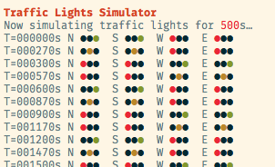
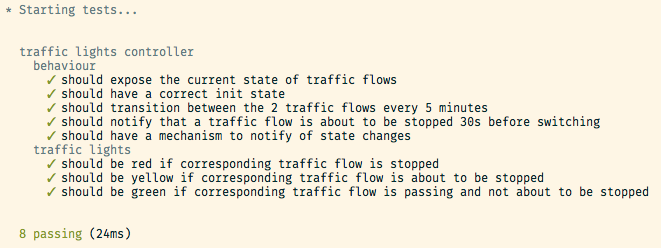

# traffic-lights-simulator

An exercise of modeling and testing the traffic lights at an intersection

Please find in this repo:
- the code of a crude traffic lights controller
- the corresponding unit tests
- a simulator

Code is written in TypeScript 2 / ES7 since it's what I'm using the most right now.

## Design

NOTE: Since it changes in every country, let's assume the traffic lights are going in cycles of:
> RED -> GREEN -> YELLOW -> ...

Here we want to simulate an intersection of 2 roads, North <-> South and East <-> West.
Without further instructions, we'll assume that the lights alternance is this trivial one:

1. N&S proceeding, E&W stopped
1. E&W proceeding, N&S stopped

It's obvious that we don't want to model the lights separately, because:

1. the N/S lights are paired to the same state, same for E/W
1. the state of N/S and E/W are also linked, when one is green or yellow, the other MUST be red, and so on.

So we'd rather model the intersection itself as having 2 traffic flows:

1. N <-> S
1. E <-> W

proceeding and stopping alternatively.


## Usage

### traffic controller
Code is written in TypeScript 2 / ES7 and exposed as JavaScript ES7 / CommonJS

```bash
npm i -S Offirmo/traffic-lights-simulator   << XXX I didn't publish it to npm to not waste their resources
```

```javascript
import * as TrafficLightsController from 'traffic-lights-simulator'

const controller = TrafficLightsController.factory({
   onStateChange: console.log
})
```

The controller immediately starts running indefinitely on invocation, starting with N<->S green.
It can be stopped with `controller.stop()`

To retrieve how the lights should be displayed for a flow according to a state:
```javascript
TrafficLightsController.getTrafficLightStateForFlow(controller.getState(), 'NS') // -> red, yellow, green
TrafficLightsController.getTrafficLightStateForFlow(controller.getState(), 'EW') // -> red, yellow, green

// or use this shortcut
controller.getTrafficLightStateForFlow('NS') // -> red, yellow, green
controller.getTrafficLightStateForFlow('EW') // -> red, yellow, green
```

But this is more convenient to do it on transitions, hence the `onStateChange` callback:
```javascript
import * as TrafficLightsController from 'traffic-lights-simulator'

const controller = TrafficLightsController.factory({
   onStateChange: (state) => {
      changeNSLightTo(TrafficLightsController.getTrafficLightStateForFlow(controller.getState(), 'NS'))
      ...
   }
})
```

The factory takes a bunch of options:
```javascript

const controller = TrafficLightsController.factory({
   // here are the default values
   SWITCH_PERIOD_S: 5 * 60,  // lights alternance period, in s
   SWITCH_NOTIFICATION_DURATION_S: 30,  // how much time before a change do we switch to yellow
   debug: false,  // prints traces on state change
   onStateChange: (state) => {} // called on state change
})
```

### Simulator
From the cloned repository, using node 7:

```bash
npm install
npm run simulate  // defaulting to simulating 1800s = 30min
npm run simulate 500
```
Should give something like that:




## Contributing
From the cloned repository, using node 7:

```bash
npm install  (do NOT use yarn, sorry)
npm run dev
npm test
```
Should give something like that:




## Possible enhancements

Extension of the model:
- for safety reasons we should have an initial state and an error state
- How about having different timings for each "flows" ? For example, N/S could be a bigger road than E/W, thus being allowed more time in "pass" state
- how about more flows than just 2, maybe flows than can be allowed in parallel
- How about linking to the state the pedestrian lights also ?
  - this is trivial with our model


